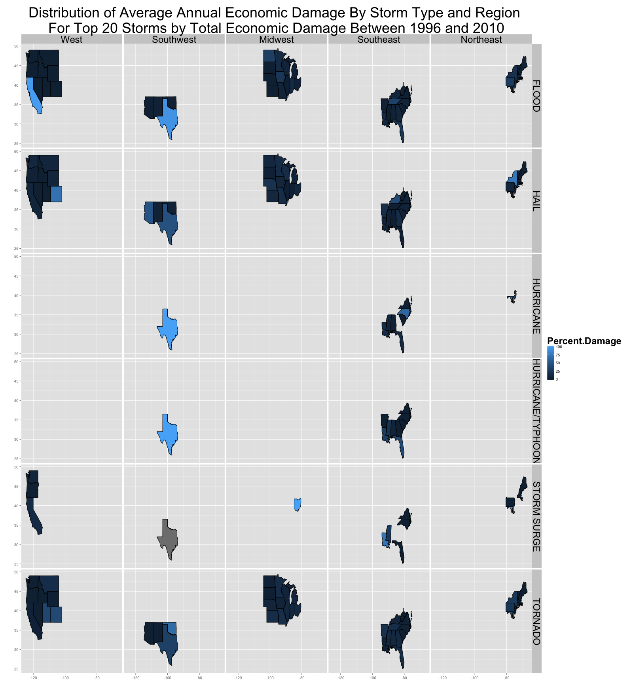

# Synopsis

As a matter of public policy, we are interested in studying severe weather events in an effort
to make sound investments that might minimize injuries, fatalities, and economic damage to 
property and crops as much as possible. This study addresses two questions:

1. Which types of events are most harmful with respect to population health?

2. Which types of events have the greatest economic consequences?

[Observations of severe weather storms](https://d396qusza40orc.cloudfront.net/repdata%2Fdata%2FStormData.csv.bz2)
collected from the 
[National Weather Service Storm Data Base Program](http://www.nws.noaa.gov/wsom/manual/archives/NF429405.HTML)
across the United States between January 1996 and December 2010 were considered for the study. 
Since not all severe weather events occur every year or in every state, we chose to look at the 
impacts of the most damaging storms collectively by region 
([defined by National Geographic magazine](http://education.nationalgeographic.com/education/maps/united-states-regions/?ar_a=1)) 
excluding U.S. territories.

# Data Processing

## Load data from raw CSV

First, we extract the storm data observations from the original National Weather Service source
and append the regional information we need to conduct the study.

```{r preload_libraries, echo = TRUE, cache = FALSE, message = FALSE}
# Pre-load all required libraries
library(dplyr)
library(ggplot2)
library(lubridate)
library(xtable)
library(maps)
```

```{r load_data, echo = TRUE, cache = TRUE, message = FALSE}
# Download and process data
# uncomment this line and set to your working directory
# setwd("~/Google Drive/projects/r/coursera/RepData_PeerAssessment2")
myfile.zip <- "StormData.csv.bz2"
myfile.url <- "https://d396qusza40orc.cloudfront.net/repdata%2Fdata%2FStormData.csv.bz2"

if (!file.exists(myfile.zip)) {
    download.file(url = myfile.url, destfile = myfile.zip, method = "curl")    
}

if (file.exists(myfile.zip)) {
    # useful during development to force the data frame to
    # be global scope and only load once, like a Singleton
    if (!exists("myfile.df")) {
        myfile.df <- read.csv(bzfile(myfile.zip))    
    }
} else {
    stop("ABORT. Input file missing, unable to download or decompress original.")
}
```

## Additional post-processing 

The source data contains a total of **`r formatC(nrow(myfile.df), format="d", big.mark=',')` observations** 
across **`r ncol(myfile.df)` variables**.  We are interested only in the following derived variables:

* total sum of all economic damage caused to property and crops
* total number of people harmed through injury or fatality
* the variances of these measurements by region and severe weather event

The original data set doesn't encode the observations by region, so we'll have to do that ourselves.
Further, the economic damage variables are stored as abbreviated measurements.  We'll have to 
expand those back to full measures in order to be able to sum them properly.

We'll end up later abbreviating the results again later when it is time to display figures.

```{r summarize_data, echo = TRUE, cache = FALSE, message = FALSE}
# Prepare regions
# http://education.nationalgeographic.com/education/maps/united-states-regions/?ar_a=1
regions <- rbind(data.frame(REGION = character(), STATE = character(), stringsAsFactors = FALSE), 
                 cbind(REGION = "West", 
                       STATE = c("WA", "OR", "ID", "MT", "WY", "CA", "NV", 
                                 "UT", "CO", "HI", "AK")),
                 cbind(REGION = "Southwest", 
                       STATE = c("AZ", "NM", "TX", "OK")),
                 cbind(REGION = "Midwest", 
                       STATE = c("ND", "SD", "NE", "KS", "MO", "IA", "MN", 
                                 "WI", "IL", "IN", "OH", "MI")),
                 cbind(REGION = "Southeast", 
                       STATE = c("AR", "LA", "MS", "AL", "GA", "FL", "SC", 
                                 "NC", "TN", "KY", "WV", "VA", "DE")),
                 cbind(REGION = "Northeast", 
                       STATE = c("MD", "PA", "NJ", "CT", "RI", "NY", "MA", 
                                 "NH", "VT", "ME"))
                 )

data("state")
us.states <- data.frame(STATE = state.abb, STATE.NAME = state.name)

# convenience tables to convert units
PROP.conversions <- rbind(
        data.frame(PROPDMGEXP = "", PROPDMGMULT = 1),
        data.frame(PROPDMGEXP = "K", PROPDMGMULT = 1000),
        data.frame(PROPDMGEXP = "M", PROPDMGMULT = 1000000),
        data.frame(PROPDMGEXP = "B", PROPDMGMULT = 1000000000)
    )

CROP.conversions <- rbind(
        data.frame(CROPDMGEXP = "", CROPDMGMULT = 1),
        data.frame(CROPDMGEXP = "K", CROPDMGMULT = 1000),
        data.frame(CROPDMGEXP = "M", CROPDMGMULT = 1000000),
        data.frame(CROPDMGEXP = "B", CROPDMGMULT = 1000000000)
    )

# Create summary table
# Break down by state, weather event type, region, and date components
# Calculate the sum of all property and crop damages as well as
# all individuals injured or killed by weather
myfile.df.summary <- myfile.df %>% 
    select(STATE,  # U.S. state
           EVTYPE, # weather event type
           FATALITIES, # number of fatalities
           INJURIES, # number of injuries
           PROPDMG, # Property Damage in abbreviated dollar amounts according to WSOM Chapter F-42
           PROPDMGEXP, # exponent for property damages
           CROPDMG, # Crop Damage in abbreviated dollar amounts according to WSOM Chapter F-42
           CROPDMGEXP, # exponent for crop damages
           BGN_DATE # Y/M/D HH:MM:SS in local time
           ) %>%
    filter(STATE %in% regions$STATE) %>%
    left_join(regions) %>%
    left_join(us.states) %>%
    left_join(PROP.conversions) %>%
    left_join(CROP.conversions) %>%
    mutate(TOTALDMG =  (PROPDMG * PROPDMGMULT) + (CROPDMG * CROPDMGMULT), 
           TOTALHARMED = FATALITIES + INJURIES,
           BEGIN_YEAR = year(mdy_hms(BGN_DATE))
           ) %>%
    # look at only recent data where there were harms or damages
    filter(BEGIN_YEAR >= 1996 & BEGIN_YEAR <= 2010 & (TOTALDMG > 0 | TOTALHARMED > 0)) %>%
    # get rid of the original metrics
    select(-PROPDMG, -CROPDMG, -FATALITIES, -INJURIES, -BGN_DATE) %>%
    group_by(BEGIN_YEAR, 
             REGION,
             STATE,
             STATE.NAME,
             EVTYPE) %>% 
    summarize(People.Harmed = sum(TOTALHARMED), Economic.Damage = sum(TOTALDMG))
```

We now have a smaller data set that is easier to work with.

## Data summarization

To address the research questions, we calculate two more summary tables.  First, we
look at the effects of severe weather on public health and the economy by region.  We use
the following definitions:

* **people harmed** is defined as the total number of people who suffered injury or were killed
* **economic damage** is measured in terms of the total dollar value of damages to crops and property

To sort out which types of severe weather have the most impact, we'll look at the average amount of 
harm that each weather type did in the years where the weather was observed.  For example, if we 
look at 15 years of data, but a hurricane appears in the data in three of those years, we'll take 
the average hurricane damage as the total number of people harmed divided by 3 (not 15).

That way, weather types that do not appear every year are not misrepresented in our survey
of damaging storm types.

We'll look only at the `r MAX_HARMS <- 20; return(MAX_HARMS)` most harmful storm types out of the 
`r length(levels(myfile.df.summary$EVTYPE))` different classifications available.

```{r summarize_harms, echo = TRUE, cache = FALSE, message = FALSE}
# Find the top most harmful storm types
top.harms <- myfile.df.summary %>% 
    select(EVTYPE, BEGIN_YEAR, STATE, STATE.NAME, People.Harmed) %>%
    group_by(EVTYPE, BEGIN_YEAR) %>% 
    summarize(Total.People.Harmed = sum(People.Harmed)) %>%
    group_by(EVTYPE) %>%
    summarize(Years.In.Range = n(),
              Total.People.Harmed = sum(Total.People.Harmed),
              Avg.Annual.People.Harmed = round(Total.People.Harmed / Years.In.Range, 0)) %>%
    arrange(-Avg.Annual.People.Harmed) %>%
    head(n = MAX_HARMS)

# Find all severe events by region
# Dollars in units of one thousand
myfile.df.summary.by.harms <- myfile.df.summary %>% 
    filter(EVTYPE %in% top.harms$EVTYPE) %>%
    select(REGION, STATE, EVTYPE, BEGIN_YEAR, People.Harmed) %>%
    group_by(REGION, EVTYPE, STATE) %>% 
    summarize(Total.People.Harmed = sum(People.Harmed)) %>%
    group_by(REGION, EVTYPE) %>%
    summarize(Years.In.Range = n(),
              Total.People.Harmed = sum(Total.People.Harmed),
              Avg.Annual.People.Harmed = round(Total.People.Harmed / Years.In.Range, 0)) %>%
    arrange(-Total.People.Harmed)
```

Overall, the storm type **`r top.harms[1,c("EVTYPE")]`** has the biggest impact nationwide on
population health affecting more people in the **`r myfile.df.summary.by.harms[1,c("REGION")]`**
more than any other region.

```{r summarize_damages, echo = TRUE, cache = FALSE, message = FALSE}
# Find the top most damaging storm types
# Measured in millions of dollars
top.damages <- myfile.df.summary %>% 
    select(EVTYPE, BEGIN_YEAR, STATE, STATE.NAME, Economic.Damage) %>%
    group_by(EVTYPE, BEGIN_YEAR) %>% 
    summarize(Total.Economic.Damage = sum(Economic.Damage)) %>%
    group_by(EVTYPE) %>%
    summarize(Years.In.Range = n(),
              Total.Economic.Damage = round(sum(Total.Economic.Damage) / 1000000, 0),
              Avg.Annual.Economic.Damage = round(Total.Economic.Damage / Years.In.Range, 0)) %>%
    arrange(-Avg.Annual.Economic.Damage) %>%
    head(n = MAX_HARMS)

# Find all severe events by region
# Dollars in units of one thousand
myfile.df.summary.by.damages <- myfile.df.summary %>% 
    filter(EVTYPE %in% top.damages$EVTYPE) %>%
    select(REGION, STATE, EVTYPE, BEGIN_YEAR, Economic.Damage) %>%
    group_by(REGION, EVTYPE, STATE) %>% 
    summarize(Total.Economic.Damage = round(sum(Economic.Damage) / 1000000, 0)) %>%
    group_by(REGION, EVTYPE) %>%
    summarize(Years.In.Range = n(),
              Total.Economic.Damage = sum(Total.Economic.Damage),
              Avg.Annual.Economic.Damage = round(Total.Economic.Damage / Years.In.Range, 0)) %>%
    arrange(-Total.Economic.Damage)
```

When we look at the economic impacts of dangerous storms, **`r top.damages[1,c("EVTYPE")]`** does the
does the most damage to property and crops, affecting more people in the 
**`r myfile.df.summary.by.damages[1,c("REGION")]`** more than any other region.

# Results

We've now completed our data processing and we're ready to look at the results.  We'll start
with the nationwide results observed **between `r min(myfile.df.summary$BEGIN_YEAR)` and
`r max(myfile.df.summary$BEGIN_YEAR)`**. These results include measurements taken from
`r length(unique(myfile.df.summary$STATE))` states not including any U.S. territories.

## 1. Which types of events are most harmful with respect to population health?

Here we'll look at the top `r MAX_HARMS` storms according to the total number of people they 
harmed and the average number of people across the United States that were impacted in the
years those storms occurred.

We'll see from our analysis that **`r top.harms[1, c(1)]`** tends to harm the
greatest number of people in the years this type of storm appeared in our data set.
**`r res <- top.harms[1, c(3)] == max(top.harms[, c(3)]); ifelse(res, "Incidentally", "However")`**
the top storm by average annual number of victims
**`r ifelse(res, "was also", "was not")`** the same storm type that harmed the
most number of people overall.

```{r figure_harms, echo = TRUE, cache = FALSE, message = FALSE, results = "asis"}
names(top.harms) <- c("Storm Type", "No. of Years Witnessed", "Total Victims", "Average No. of Victims Per Year Witnessed") 
print(xtable(top.harms[,c(1, 4, 3, 2)], 
             caption = paste("Top", MAX_HARMS, 
                             "Storms Most Harmful to Public Health<br />",
                             "By Average Number of Victims Annually"),
             display = c("s", "s", "d", "d", "d")), 
             type = "html")
```


## 2. Which types of events have the greatest economic consequences?

Here we'll look at the top `r MAX_HARMS` storms according to the total damage they inflicted on
the U.S. Economy and the average amount of damage they did each year they occurred.

```{r figure_damages, echo = TRUE, cache = FALSE, message = FALSE, results = "asis"}
names(top.damages) <- c("Storm Type", "No. of Years Witnessed", "Total Economic Damage", "Average Damage Per Year Witnessed") 
print(xtable(top.damages[,c(1, 4, 3, 2)], 
             caption = paste("Top", MAX_HARMS, 
                             "Storms Most Damaging to U.S. Economy<br />",
                             "In Millions of Dollars per Year"),
             display = c("s", "s", "d", "d", "d")), 
             type = "html")
```

## Final summary

Now, we'll visualize our results in the form of a U.S. map.  Here, we'll only look at the
`r MAX_PANELS <- 6; return(MAX_PANELS)` most damaging storm types: 
**`r top.damages[1,c("Storm Type")]`**, **`r top.damages[2,c("Storm Type")]`** and 
**`r top.damages[3,c("Storm Type")]`**.

The panels in the plot below give some feedback to policy makers on which kinds of storm
prevention or early detection could be implemented.

```{r figure_usmap, echo = TRUE, cache = FALSE, message = FALSE}
# draw panel with the top storms
top.storms <- top.damages[1:min(MAX_PANELS, nrow(top.damages)),c("Storm Type")]
draw.states <- map_data("state")

top.storms.totals <- myfile.df.summary.by.damages %>% 
    filter(EVTYPE %in% top.storms) %>%
    select(REGION, EVTYPE, Total.Economic.Damage) %>%
    group_by(EVTYPE, REGION) %>% 
    summarize(Total.EVTYPE.Economic.Damage = round(sum(Total.Economic.Damage), 0))

top.storms.summary <- myfile.df.summary %>% 
    filter(EVTYPE %in% top.storms) %>%
    select(REGION, STATE.NAME, EVTYPE, Economic.Damage) %>%
    group_by(EVTYPE, REGION, STATE.NAME) %>% 
    summarize(Total.Economic.Damage = round(sum(Economic.Damage) / 1000000, 0)) %>%    
    merge(top.storms.totals) %>%
    mutate(Percent.Damage = round(100 * Total.Economic.Damage / Total.EVTYPE.Economic.Damage, 3)) %>%
    mutate(region = tolower(STATE.NAME)) %>%
    select(EVTYPE, region, REGION, Percent.Damage)

top.storms.merged <- merge(draw.states, top.storms.summary, sort = FALSE, by = "region")
top.storms.merged <- top.storms.merged[order(top.storms.merged$order), ]
```
```{r maps.png, echo = TRUE, cache = FALSE, message = FALSE, comment = NA, warning = FALSE}
png("maps.png",height=1750, width=1600)
p1 <- qplot(main=paste("Distribution of Economic Damage By Storm Type and Region",
                       "\nTop Storms by Total Economic Damage", sep = ""),
            long, 
            lat, 
            data = top.storms.merged, 
            facets = EVTYPE ~ REGION,
            group = group, 
            fill = Percent.Damage,
            geom = "polygon",
            xlab = "",
            ylab = "") +
      geom_path(color="black") +
      #coord_equal() +
      theme(strip.text.x = element_text(size = 24),
            strip.text.y = element_text(size = 24),
            title = element_text(size = 40),
            legend.background = element_rect(size = 20))
print(p1)
dev.off()
```

